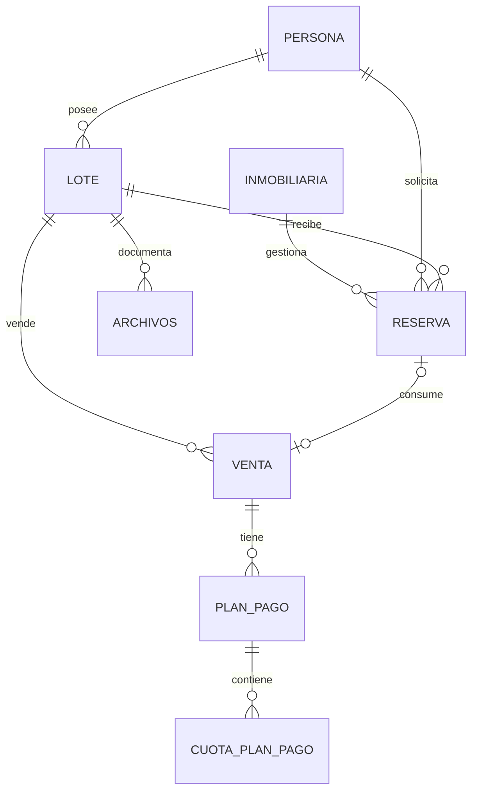

# Modelo de datos

La fuente del modelo es [`Backend/prisma/schema.prisma`](../../Backend/prisma/schema.prisma).

| Entidad | Responsabilidad | Relaciones principales |
|---|---|---|
| User | Credenciales y rol. | Persona, inmobiliaria, archivos. |
| Persona | Persona física/jurídica y grupo familiar. | Lotes, reservas, ventas, alquileres. |
| Lote | Inventario territorial y comercial. | Fracción, ubicación, propietario, reservas, ventas, prioridades, promociones y archivos. |
| Reserva | Negociación temporal. | Lote, cliente, inmobiliaria, ofertas y venta. |
| Venta | Operación comercial. | Lote, comprador, inmobiliaria, reserva, archivos y pagos. |
| PlanPago / CuotaPlanPago / PagoRegistrado | Cobranza versionada. | Venta, cuotas y pagos. |
| Inmobiliaria | Agencia asociada. | Clientes, reservas, ventas y prioridades. |
| Prioridad / Promocion | Condiciones temporales del lote. | Lote e inmobiliaria según corresponda. |
| Archivos | Metadatos documentales. | Lote, venta, usuario. |
| Fraccion / Ubicacion / Alquiler | Organización espacial y ocupación. | Lote y persona. |

## Restricciones y estados

- Identificadores de persona, números de fracción/reserva/venta/prioridad y claves de usuario son únicos según el esquema.
- Una reserva se vincula de forma única a su venta consumidora; cuotas únicas por plan y número.
- Estados relevantes: lote, reserva, venta, prioridad, cobro y estado operativo (`OPERATIVO`/`ELIMINADO`).
