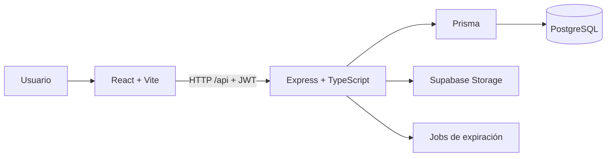

# Arquitectura general

El sistema es una aplicación web con frontend React/Vite, API HTTP Express en TypeScript y PostgreSQL administrado mediante Prisma. El backend concentra autenticación, validaciones, autorización, reglas de negocio, expiraciones e integración de archivos.

## Módulos principales

- Frontend: rutas, autenticación, RBAC de UI, páginas y componentes reutilizables.
- API: autenticación, lotes, reservas, ventas/pagos, personas, inmobiliarias, prioridades, archivos, fracciones y ubicaciones.
- Persistencia: Prisma sobre PostgreSQL.
- Archivos: integración backend con Supabase.

## Decisiones relevantes

- Backend separado en rutas, controladores, servicios, validaciones y middleware.
- Frontend separado en páginas, componentes, `lib/api`, hooks y utilidades.
- JWT y autorización por rol reforzada por UI.
- Eliminación lógica para preservar trazabilidad.

## Riesgos y pendientes

- La configuración CORS actual es permisiva; endurecerla antes de producción.
- `Documentacion/` sigue siendo la fuente histórica; decisiones no inferibles del código requieren validación del equipo.
- Mientras la especificación OpenAPI permanezca sin reconciliar, el comportamiento vigente debe verificarse contra rutas, validaciones Zod, implementación y pruebas. El objetivo es reconciliar la especificación y mantenerla alineada como contrato formal de la API. `Backend/documents/documentacionApi.yaml` todavía no está validado como contrato oficial.
