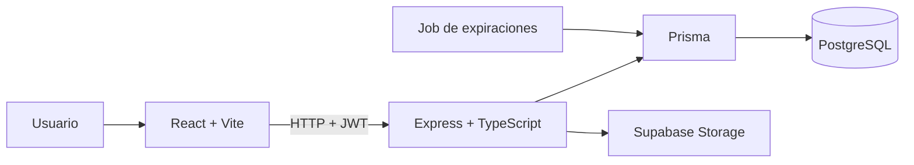
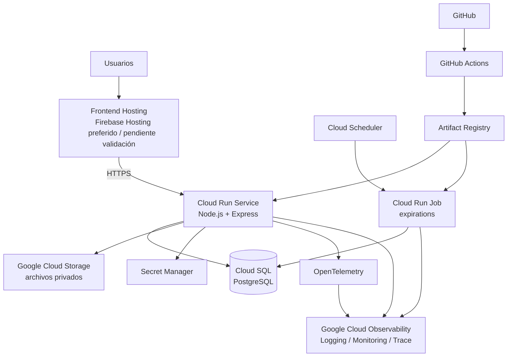

> **Estado:** Propuesta TARGET v1 
> **Proyecto:** Club de Campo La Federala  
> **Materia:** Desarrollo de Software Cloud — UTN FRLP  
> **Región cloud propuesta:** `southamerica-east1` (São Paulo)  
> **Última actualización:** septiembre 2026

---

## 1. Objetivo

Con este documento buscamos describir la arquitectura Cloud propuesta para la evolución del sistema de gestión del Club de Campo La Federala.

La propuesta no parte de una aplicación nueva. El proyecto cuenta actualmente con una aplicación web funcional basada en:

- React + Vite para el frontend.
- Node.js + Express + TypeScript para la API.
- Prisma como ORM.
- PostgreSQL como base de datos.
- Supabase Storage para almacenamiento de archivos.
- JWT y RBAC para autenticación y autorización.
- Un proceso independiente para las expiraciones de reservas y promociones.

El objetivo de la arquitectura Cloud es profesionalizar esta solución para que pueda:

- desplegarse de manera reproducible;
- operar en un entorno administrado;
- preservar datos reales;
- escalar sin rediseñar completamente la aplicación;
- reducir tareas operativas manuales;
- mantener costos razonables para la escala inicial del Club;
- mejorar seguridad, trazabilidad y observabilidad;
- permitir una futura transición desde el entorno académico hacia un entorno productivo administrado por La Federala.

---

## 2. Principios arquitectónicos

Las decisiones de arquitectura se guían por los siguientes principios.

### 2.1 Arquitectura estable, capacidad variable

Se priorizan servicios que permitan comenzar con una configuración pequeña y posteriormente crecer mediante cambios de capacidad o configuración.

Ejemplos:

- Cloud Run puede comenzar con `min instances = 0` y aumentar posteriormente.
- Cloud SQL puede comenzar con una instancia pequeña y aumentar CPU, RAM, almacenamiento o disponibilidad.
- Cloud Storage puede crecer desde pocos objetos hasta miles sin cambiar la lógica de negocio.

Se busca evitar soluciones temporales que requieran posteriormente una reescritura de la aplicación.

---

### 2.2 Servicios gestionados

Cuando existe una alternativa administrada adecuada, se prioriza sobre infraestructura propia.

Esto nos va reducir tareas como:

- administración de servidores;
- aplicación de parches;
- renovación de certificados;
- manejo manual de procesos;
- mantenimiento de sistemas operativos;
- operación de infraestructura auxiliar.

Buscamos algo profesional y adecuado al Club de Campo pero que nos permite ir progresando y que no sea algo complicado desde el inicio

---

### 2.3 Complejidad proporcional al problema

No se incorporan tecnologías únicamente para aumentar la sofisticación del sistema.

Por el momento no se considera necesario utilizar:

- Kubernetes;
- microservicios;
- service mesh;
- Kafka;
- Redis;
- infraestructura multi-región;
- balanceadores externos;
- stacks propios de observabilidad.

Estos componentes podrán reevaluarse si aparecen requisitos concretos que los justifiquen.

---

### 2.4 Portabilidad razonable

Aunque Google Cloud Platform es el proveedor principal propuesto, se intenta mantener la aplicación desacoplada de él cuando resulta razonable.

Ejemplos:

- PostgreSQL como motor de base de datos.
- Contenedores Docker para el backend.
- HTTP como interfaz principal.
- OpenTelemetry como estándar de observabilidad.
- Variables de entorno como contrato de configuración.

---

### 2.5 Seguridad por mínimo privilegio

Cada workload debe poseer solamente los permisos necesarios para realizar su función.

Se evita compartir credenciales o identidades generales entre componentes.

---

## 3. Escenario inicial esperado

La arquitectura se dimensiona inicialmente para un sistema de escala reducida pero con destino real a producción.

### Usuarios

Se estima inicialmente:

- más de 10 usuarios;
- menos de 100 usuarios;
- crecimiento moderado en el corto plazo, asociado a luego la adaptación e intención que luego tenga el cliente

### Datos

El sistema administra información persistente y no descartable.

Incluye, entre otros:

- lotes;
- personas;
- reservas;
- ventas;
- pagos;
- documentos;
- imágenes;
- escrituras;
- planos;
- archivos asociados a operaciones.

El almacenamiento de archivos puede crecer a miles de objetos y una cantidad significativa de gigabytes con el paso del tiempo.

### Disponibilidad

Para preproducción no se requiere inicialmente alta disponibilidad estricta.

Para producción deberán definirse junto al cliente:

- tolerancia a interrupciones;
- expectativas de disponibilidad;
- RTO;
- RPO;
- necesidad o no de alta disponibilidad de base de datos.

---

# 4. Arquitectura actual — CURRENT

Actualmente el sistema posee la siguiente estructura lógica:



### Características actuales

El backend concentra:

- autenticación;
- autorización;
- validaciones;
- reglas de negocio;
- acceso a datos;
- gestión de archivos.

Las expiraciones de reservas y promociones ya fueron desacopladas del servidor HTTP y se ejecutan mediante un runner independiente.

La aplicación ya dispone de:

- build productivo del backend;
- endpoint `/health`;
- graceful shutdown;
- configuración mediante variables de entorno;
- validación fail-fast de configuración.

Estas características permiten comenzar la migración hacia un entorno Cloud sin rediseñar la aplicación.

---

# 5. Arquitectura objetivo — TARGET v1

La arquitectura propuesta utiliza principalmente servicios gestionados de Google Cloud Platform.



---

# 6. Backend — Cloud Run Service

## Decisión

Se propone utilizar **Google Cloud Run** para ejecutar la API HTTP.

## Motivos

El backend actual:

- utiliza Node.js;
- expone una API HTTP;
- es containerizable;
- puede operar de forma stateless;
- ya implementa graceful shutdown;
- utiliza configuración externa;
- no necesita acceso permanente al sistema operativo.

Cloud Run permite:

- ejecutar contenedores sin administrar servidores;
- escalar automáticamente;
- reducir instancias a cero en períodos sin tráfico;
- establecer límites máximos de instancias;
- modificar CPU y memoria sin cambiar la aplicación.

## Alternativas consideradas

### Compute Engine

Es técnicamente válida, pero agrega tareas de:

- administración de VM;
- sistema operativo;
- actualizaciones;
- escalamiento;
- supervisión del runtime.

No presenta ventajas suficientes para la escala actual.

### Google Kubernetes Engine

Ofrece mayor control y capacidades de orquestación, pero introducir Kubernetes para un backend y un job sería una complejidad innecesaria.

### App Engine

También podría alojar el backend, pero Cloud Run se adapta mejor al enfoque basado en contenedores y ofrece mayor portabilidad.

---

# 7. Base de datos — Cloud SQL PostgreSQL

## Decisión

Se propone migrar PostgreSQL desde el proveedor actual hacia **Cloud SQL for PostgreSQL**.

## Motivos

Permite conservar:

- PostgreSQL;
- Prisma;
- modelos de datos;
- migraciones;
- lógica de persistencia.

Cloud SQL aporta:

- administración gestionada del motor;
- backups;
- recuperación;
- monitoreo;
- integración con GCP;
- escalamiento vertical.

## Preproducción

La primera instancia debería ser pequeña y de una sola zona.

La alta disponibilidad no se considera necesaria inicialmente para staging.

## Producción

El dimensionamiento productivo deberá decidirse utilizando:

- métricas reales;
- presupuesto del Club;
- disponibilidad requerida;
- volumen de datos.

La arquitectura no cambia si posteriormente se aumenta CPU, memoria, almacenamiento o disponibilidad.

---

# 8. Networking de Cloud SQL — decisión abierta

La conectividad entre Cloud Run y Cloud SQL todavía se encuentra bajo evaluación.

## Alternativa A — Public IP + integración segura de Cloud SQL

Ventajas:

- menor complejidad;
- administración más sencilla;
- acceso más simple desde herramientas externas;
- no requiere inicialmente una VPC propia.

La conexión continúa protegida mediante los mecanismos de autenticación y autorización de Cloud SQL.

## Alternativa B — Private IP + VPC

Arquitectura posible:

```text
Cloud Run
    ↓
Direct VPC Egress
    ↓
Custom VPC
    ↓
Cloud SQL private IP
```

Ventajas:

- mayor aislamiento de red;
- la base de datos no posee endpoint público.

Costo:

- mayor complejidad de configuración;
- mayor complejidad operativa para accesos administrativos y troubleshooting.

## Estado

**Pendiente de decisión.**

La elección deberá evaluar si el incremento de aislamiento justifica la complejidad operativa adicional para el contexto de La Federala. Para eso queremos todavía entender bien si es algo que nos conviene adoptar o no, tanto en costo como en otros términos.

---

# 9. Almacenamiento de archivos — Google Cloud Storage

## Decisión

Se propone utilizar **Google Cloud Storage** como almacenamiento persistente de objetos.

## Motivos

El sistema almacena:

- imágenes;
- documentos;
- planos;
- escrituras;
- archivos relacionados con operaciones.

Este tipo de información no debe almacenarse dentro del filesystem de Cloud Run, ya que las instancias son efímeras.

Cloud Storage permite:

- almacenamiento durable;
- crecimiento independiente del backend;
- control de acceso mediante IAM;
- signed URLs;
- políticas de recuperación;
- integración con GCP.

## Configuración inicial propuesta

- bucket privado;
- región `southamerica-east1`;
- Storage Class Standard;
- Public Access Prevention;
- acceso mediante Service Account;
- signed URLs para descargas;
- Soft Delete habilitado;
- Object Versioning deshabilitado inicialmente.

La aplicación ya utiliza rutas únicas por archivo y mantiene el historial lógico desde PostgreSQL, por lo que inicialmente no resulta necesario duplicar ese mecanismo mediante Object Versioning.

---

# 10. Procesos programados — Cloud Run Jobs + Cloud Scheduler

Actualmente existen dos procesos programados:

- expiración de promociones;
- expiración de reservas.

Ambos se ejecutan desde un runner one-shot.

## Arquitectura propuesta

```text
Cloud Scheduler
       ↓
Cloud Run Job
       ↓
runExpirations
       ├── expirePromotions
       └── expireReservas
       ↓
Cloud SQL
```

## Cloud Run Job

Permite ejecutar el mismo artefacto del backend con un comando diferente.

Ejemplo conceptual:

```text
Service
node dist/server.js

Job
node dist/jobs/runExpirations.js
```

## Cloud Scheduler

Será responsable únicamente de disparar periódicamente el Job.

La frecuencia inicial podrá mantener la cadencia actualmente utilizada y deberá validarse contra las necesidades del negocio.

No se incorporarán nuevos jobs sin una necesidad funcional concreta. Aunque lo vamos a evaluar si sentimos que necesitamos nuevos de acuerdo a si los descubrimos y tomamos la decisión como equipo de crearlos.

---

# 11. Gestión de configuración y secretos

Se diferencian tres conceptos.

## Configuración

Valores no sensibles:

- `NODE_ENV`;
- `FRONTEND_URL`;
- configuración de bucket;
- expiración de JWT;
- otros parámetros funcionales.

Se configurarán mediante environment variables de Cloud Run.

---

## Secretos

Valores sensibles:

- `JWT_SECRET`;
- credenciales de base de datos;
- futuras API keys externas.

Se almacenarán mediante **Google Secret Manager**.

La aplicación seguirá consumiéndolos mediante variables de entorno, manteniendo independencia respecto de Secret Manager.

---

## Identidad

Los workloads utilizarán **Google Cloud Service Accounts**.

No se descargarán Service Account JSON Keys para los workloads ejecutados dentro de GCP.

---

# 12. IAM y mínimo privilegio

Se propone separar identidades según responsabilidad.

## Backend web

Ejemplo conceptual:

```text
federala-web-sa
```

Necesitará acceso a:

- Cloud SQL;
- Cloud Storage;
- determinados secretos.

---

## Job de expiraciones

```text
federala-expirations-sa
```

Necesitará:

- Cloud SQL;
- credenciales correspondientes.

No necesita acceso a archivos ni al JWT del servidor web.

---

## Scheduler

```text
federala-scheduler-sa
```

Su responsabilidad será únicamente ejecutar el Cloud Run Job.

---

## CI/CD

Una identidad independiente permitirá a GitHub Actions:

- publicar artefactos;
- desplegar servicios autorizados.

La identidad de deployment no debe ser la misma identidad utilizada durante runtime.

---

# 13. Frontend Hosting — decisión preferida

## Opción actualmente preferida

**Firebase Hosting**

Se considera una buena alternativa debido a:

- compatibilidad directa con una SPA React/Vite;
- HTTPS administrado;
- CDN;
- custom domains;
- bajo costo inicial;
- integración con el mismo ecosistema GCP;
- baja carga operativa.

## Alternativas todavía consideradas

### Vercel

Ventajas:

- excelente experiencia de desarrollo;
- previews automáticos;
- despliegue frontend muy simple.

### Cloud Run

Permitiría servir el frontend mediante un contenedor, pero agrega runtime y mantenimiento innecesarios para una SPA estática.

### GCS + Load Balancer + CDN

Brinda mayor control sobre la infraestructura, aunque agrega complejidad que actualmente no parece necesaria.

## Estado

**Firebase Hosting es actualmente la alternativa preferida, pero la decisión debe ser validada junto al equipo, la cátedra y el cliente.**

---

# 14. Observabilidad

## Plataforma

Se utilizarán los servicios gestionados de Google Cloud Observability:

- Cloud Logging;
- Cloud Monitoring;
- Cloud Trace;
- Error Reporting;
- alertas;
- health monitoring.

## Primera etapa

La observabilidad inicial deberá incluir:

- logs estructurados;
- métricas automáticas de Cloud Run;
- monitoreo de `/health`;
- alertas básicas;
- fallos de Cloud Run Jobs.

## OpenTelemetry

Se utilizará **OpenTelemetry** como estándar de instrumentación de aplicación.

Su incorporación será progresiva.

Inicialmente se utilizará principalmente para tracing.

Esto permite separar:

```text
instrumentación
OpenTelemetry

de

backend de observabilidad
Google Cloud Observability
```

y reduce el acoplamiento con un proveedor específico.

---

# 15. CI/CD

## Plataforma

Se utilizará **GitHub Actions**.

La estrategia se divide en:

```text
CI
↓
Build / Release
↓
Deployment
```

---

## Continuous Integration

Cada Pull Request deberá ejecutar progresivamente validaciones como:

### Backend

- instalación reproducible;
- generación Prisma;
- typecheck;
- tests;
- build.

### Frontend

Inicialmente:

- instalación;
- lint;
- build.

Se incorporarán tests frontend e integración a medida que la infraestructura de testing madure.

---

## Artefacto backend

El backend será construido como imagen Docker.

```text
source
↓
Docker build
↓
Artifact Registry
↓
Cloud Run
```

El mismo artefacto deberá utilizarse para:

- Cloud Run Service;
- Cloud Run Job.

---

## Artifact Registry

Las imágenes se almacenarán en **Google Artifact Registry**.

Se evitará depender exclusivamente de tags mutables como `latest`.

Los releases deberán poder identificarse mediante commit SHA y/o image digest.

---

## GitHub → GCP

La autenticación entre GitHub Actions y Google Cloud utilizará:

**Workload Identity Federation + OIDC**

Se evitarán credenciales JSON persistentes almacenadas como GitHub Secrets.

---

## Staging

Luego de integrar cambios en `main`:

```text
main
↓
CI
↓
build
↓
Artifact Registry
↓
deploy staging
↓
smoke tests
```

La automatización completa se implementará progresivamente luego de comprender y validar manualmente el primer deployment.

---

## Producción

Producción no debe desplegarse automáticamente ante cada cambio en `main`.

El flujo objetivo es:

```text
staging
↓
QA
↓
aprobación explícita
↓
producción
```

El mismo artefacto probado en staging debe ser promocionado a producción.

---

# 16. Entornos

Se propone separar los ambientes.

## Desarrollo

```text
LOCAL
```

- frontend local;
- backend local;
- base de datos de desarrollo;
- `.env` local.

---

## Preproducción

Proyecto independiente:

```text
federala-staging
```

Este entorno permitirá:

- QA;
- pruebas de integración;
- demos;
- validación con cliente;
- validación académica.

Debe utilizar datos ficticios o anonimizados siempre que sea posible.

---

## Producción

Proyecto independiente:

```text
federala-production
```

Este proyecto deberá contener únicamente recursos productivos.

Los datos, secretos, identidades y permisos estarán separados de staging.

La intención es que producción quede finalmente bajo propiedad y facturación de La Federala.

---

# 17. Región

Se propone utilizar:

```text
southamerica-east1
São Paulo
```

como región principal.

Se busca mantener próximos:

- Cloud Run;
- Cloud Run Jobs;
- Cloud SQL;
- Cloud Storage;
- Artifact Registry.

La co-localización permite reducir:

- latencia;
- tráfico interregional;
- complejidad.

La elección podriamos verificarla mediante mediciones antes de producción si es que va mal o no de la forma esperada.

---

# 18. Seguridad

La arquitectura propone las siguientes medidas principales:

- workloads con identidades propias;
- IAM con mínimo privilegio;
- secretos fuera del código;
- Secret Manager;
- buckets privados;
- signed URLs;
- base de datos gestionada;
- separación staging / producción;
- ausencia de Service Account Keys persistentes;
- HTTPS administrado;
- RBAC a nivel de aplicación;
- logs y auditoría centralizados.

La seguridad vamos a continuar refinándola durante el desarrollo si vemos algun punto insatisfecho .

---

# 19. Backups y recuperación

No se crearán procesos propios para realizar backups de base de datos.

Se utilizarán las capacidades gestionadas de Cloud SQL.

La política definitiva de:

- backups;
- retención;
- PITR;
- RPO;
- RTO;

se definirá antes de producción junto al cliente, en base a lo que quieran y a lo que esten dispuestos a asumir.

Para archivos, Google Cloud Storage permitirá mecanismos de recuperación como Soft Delete.

---

# 20. Costos y dimensionamiento

La arquitectura está diseñada para comenzar con bajo consumo.

El principal costo fijo esperado será Cloud SQL.

Otros componentes tendrán costos inicialmente bajos debido al volumen reducido esperado:

- Cloud Run;
- Cloud Storage;
- Cloud Scheduler;
- Cloud Run Jobs;
- Secret Manager;
- observabilidad.

Durante staging se utilizarán los créditos GCP disponibles para:

- validar la arquitectura;
- medir consumo real;
- estimar costos productivos.

Antes de pasar a producción se deberá presentar al Club una estimación actualizada de costos.

---

# 21. Inteligencia Artificial

La incorporación de Inteligencia Artificial forma parte de los requisitos del proyecto académico en si.

Sin embargo, actualmente no existe una definición funcional que le hayamos dado que sea suficientemente madura de un caso de uso. Se está evaluando su incorporación en funcionalidades relacionadas con reportes que el módulo que tenemos restante pero no queremos elegir por elegir.

No se seleccionará:

- modelo;
- proveedor;
- arquitectura RAG;
- almacenamiento vectorial;
- servicio específico;

hasta contar con una necesidad funcional clara.

Esta decisión se mantiene conscientemente abierta para evitar introducir tecnología sin un problema definido.

---

# 22. Autenticación

El sistema posee actualmente autenticación propia basada en JWT y autorización mediante roles.

En esta etapa no se propone migrar automáticamente hacia un proveedor de autenticación administrado.

La solución existente será revisada desde el punto de vista de:

- seguridad;
- mantenimiento;
- escalabilidad;
- gestión de sesiones/tokens.

Solo se considerará una migración si existe un beneficio claro que justifique el cambio.

---

# 23. Decisiones abiertas

Actualmente quedan abiertas principalmente las siguientes decisiones.

| Tema | Estado |
|---|---|
| Frontend Hosting | Firebase Hosting preferido; pendiente validación |
| Cloud SQL networking | Public IP segura vs Private IP + VPC |
| Inteligencia Artificial | Caso de uso todavía no definido |
| Política productiva de HA | Definir junto al cliente |
| RPO / RTO | Definir junto al cliente |
| Dominio productivo | Definir junto al cliente |

---

# 24. Evolución futura

La arquitectura permite incorporar progresivamente mejoras sin requerir una reescritura completa.

Posibles evoluciones:

- aumento de recursos de Cloud Run;
- min instances;
- mayor sizing de Cloud SQL;
- HA de Cloud SQL;
- infraestructura como código mediante Terraform;
- External Application Load Balancer;
- Cloud Armor;
- métricas personalizadas;
- Managed Prometheus;
- automatización completa de CD;
- autenticación administrada si se justifica;
- infraestructura específica para IA.

Estas tecnologías no las pensamos para que forman parte del TARGET inicial salvo que aparezca un requisito que las justifique.

---

# 25. Resumen de decisiones

| Área            | Decisión                         | Estado       |
| --------------- | -------------------------------- | ------------ |
| Compute backend | Cloud Run Service                | ✅            |
| Persistencia    | Cloud SQL PostgreSQL             | ✅            |
| Archivos        | Google Cloud Storage             | ✅            |
| Jobs            | Cloud Run Jobs                   | ✅            |
| Scheduling      | Cloud Scheduler                  | ✅            |
| Secrets         | Secret Manager                   | ✅            |
| Identidad       | IAM + Service Accounts           | ✅            |
| Frontend        | Firebase Hosting                 | 🟡 Preferido |
| Observabilidad  | Google Cloud Observability       | ✅            |
| Instrumentación | OpenTelemetry                    | ✅ progresivo |
| CI/CD           | GitHub Actions                   | ✅            |
| Registry        | Artifact Registry                | ✅            |
| GitHub → GCP    | WIF/OIDC                         | ✅            |
| Entornos        | proyectos staging/prod separados | ✅            |
| Región          | southamerica-east1               | ✅            |
| Networking DB   | Public vs Private                | 🟡           |
| IA              | pendiente definición funcional   | 🟡           |
