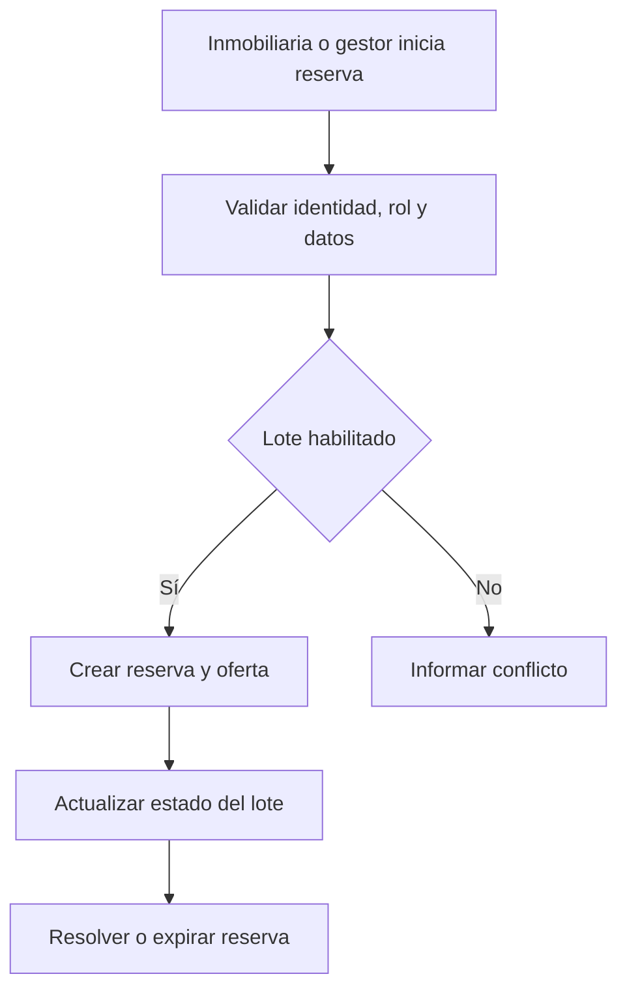
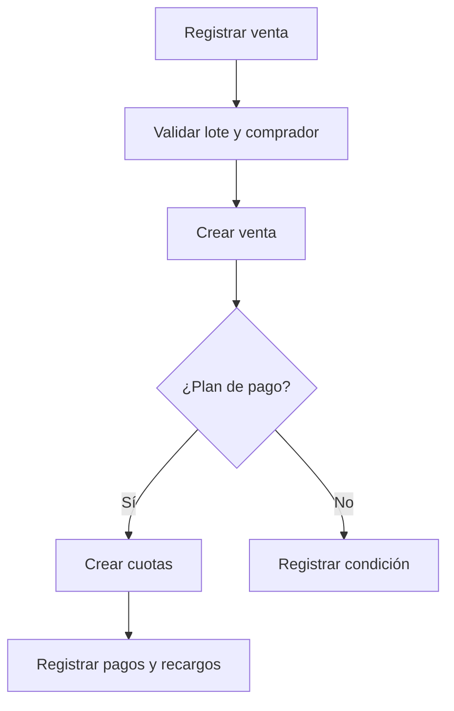

# Flujos principales

## Reserva de lote

```mermaid
flowchart TD
  A[Inmobiliaria o gestor inicia reserva] --> B[Validar identidad, rol y datos]
  B --> C{Lote habilitado}
  C -->|Sí| D[Crear reserva y oferta]
  D --> E[Actualizar estado del lote]
  E --> F[Resolver o expirar reserva]
  C -->|No| G[Informar conflicto]
```

## Venta y cobranza

```mermaid
flowchart TD
  A[Registrar venta] --> B[Validar lote y comprador]
  B --> C[Crear venta]
  C --> D{¿Plan de pago?}
  D -->|Sí| E[Crear cuotas]
  E --> F[Registrar pagos y recargos]
  D -->|No| G[Registrar condición]
```
